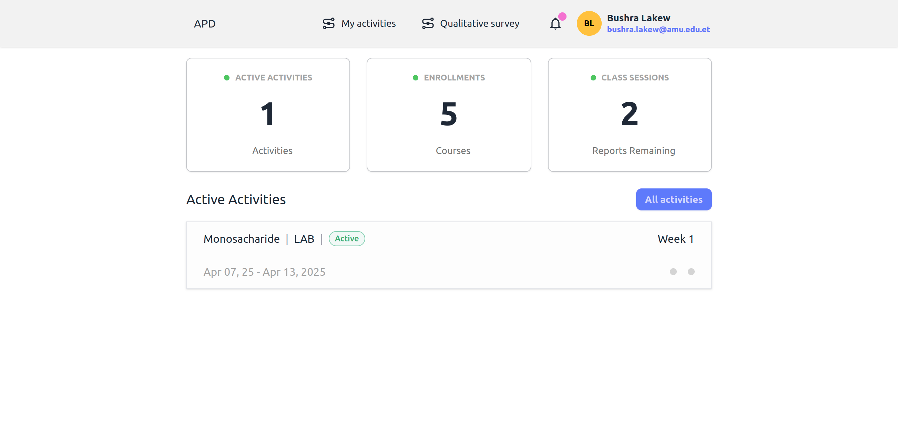

# 👋 Welcome, Students

WebAPD helps you submit course data and feedback efficiently. Follow these steps:

1. **Set up your account** → [Account Setup Guide](setup-account)
2. **Log in** → [Login Instructions](login-instructions)
3. **Submit data** → [Quantitative/Survey Guides](quantitative-survey-guide)
4. **Telegram integration** → [Telegram Integration](telegram-integration)

🔹 **Need help?** Email <wuletawwonte@gmail.com>.

