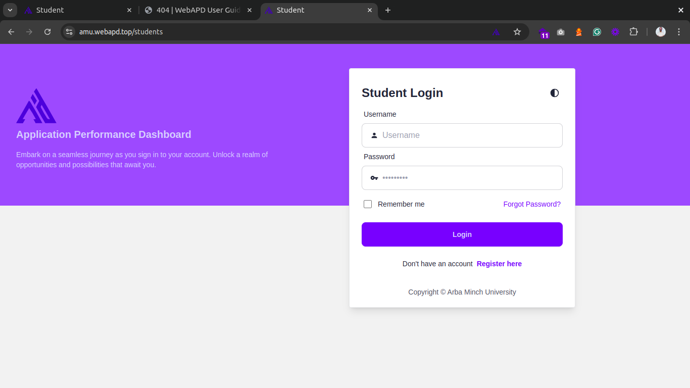

# Login Instructions

## **Accessing Your Student Account**

### Prerequisites

- Registered student account
- Valid email and password

### Steps

1. Visit the WebAPD student login page: [https://amu.webapd.top/students](https://amu.webapd.top/students).  
   

2. Ensure the URL includes `/students` (not for staff).

3. Enter your credentials:

   ```markdown
   - Email: (Use your registered email)
   - Password: (The one you set during registration)
   ```

4. Click **Login** to access your account.
5. Account Not Recognized? Ensure you are using the correct email or register first.

## Forgot Your Password?

If you can’t remember your password:

1. Click **Forgot Password?** on the login page and this page will appear:


2. Enter your registered email address: Make sure to use the same email you registered with.
3. Check your inbox for a password reset link (check spam/junk if missing).
4. Click the link and follow the prompts to set a new password.
