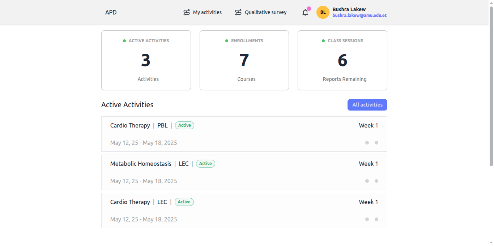

# Quantitative Survey Guide

## Reporting Course Activity Status

### Prerequisites

- You must be logged into your student account
- You must be assigned as an informant for one or more course activities
- The current week must have activities requiring status reporting

### Steps to Submit Activity Status

1. After logging in, go to the "Active activities" section from your homepage.
2. You'll see a list of course activities you're assigned to report on for the current week.

   

3. Select an activity from the "Active activities" list. This will open the Activity Weeks page, where the current week is automatically activated for reporting.

   

4. Click the plus (+) button at the top-right corner of the current week’s card.

> Note: The (+) button is only clickable for the current week. If you navigate to past or upcoming weeks (using the week pills at the top), the button will be disabled.

5. A confirmation modal will appear, asking if "Class held?"

   
   Select Yes or No using the radio buttons.

6. If you selected "Yes", Enter the session length in hours (e.g., 2 for a 2-hour session). If you selected "No", No additional input is required.

7. Submit your response by clicking the "Submit" button in the modal.

Your activity status for the week will now be recorded.
