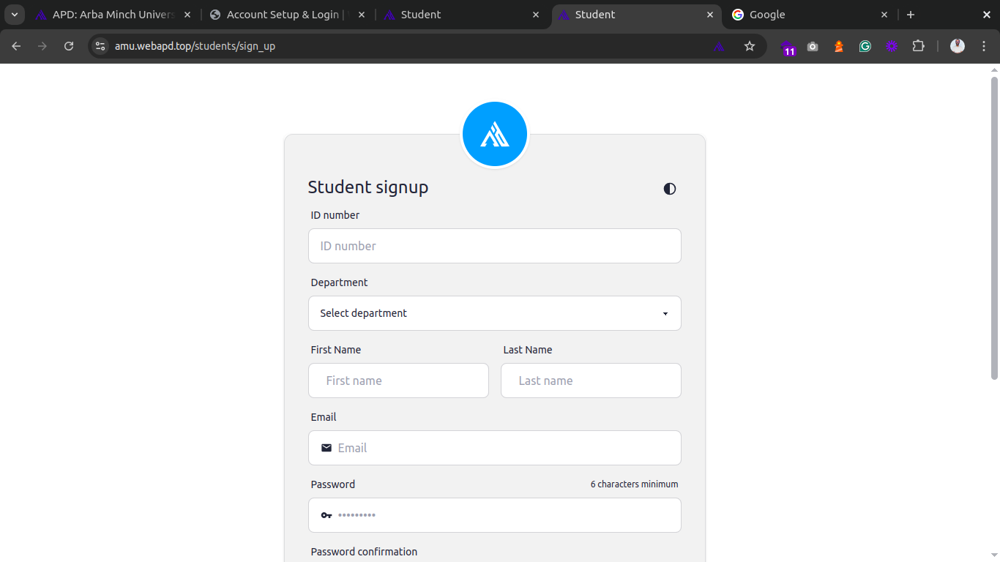

# Account Setup

## **Register as a Student**

### Prerequisites

- Active email
- Student ID (e.g., `NHS7686-23`)

### Steps

1. Visit WebAPD user Registration page: [https://cmhs.apd.et/users/sign_up](https://cmhs.apd.et/users/sign_up).
   
   _You can also open [https://cmhs.apd.et](https://cmhs.apd.et) and click on the Sign up link._
2. Fill in:

   ```markdown
   - Register as: Student
   - Student ID: (as provided)
   - Department: Choose your department
   - Your Name: Please enter your name exactly as it appears on your student ID card.
   - Email: Please use your university-provided email; personal emails are also accepted.
   - Password: (8+ chars, include a number)
   - Terms and Conditions: Please read and accept
   ```

   _Ensure all details are correct before submitting._

4. Click the **Signup** button to complete your registration. You will be automatically logged into the system.
