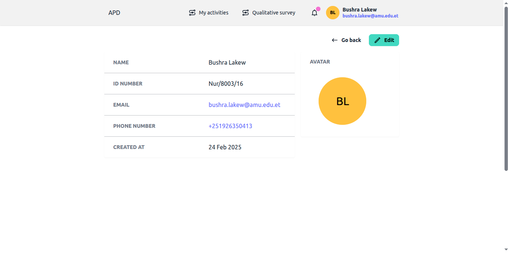
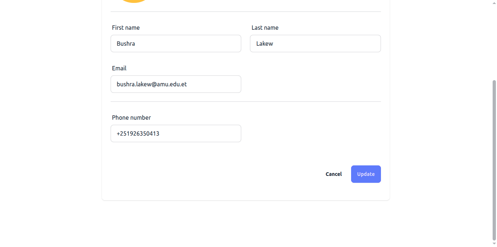
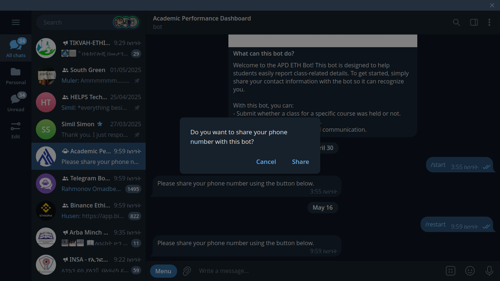

# How to Submit Activity Status via Telegram

## Step 1: Register Your Telegram Phone Number

1. Log in to the web platform.
2. Click your profile icon (top-right corner) and select "My Profile" from the dropdown menu.
3. On your profile page, click the "Edit" button.
   
4. Scroll to the "Phone number" field and enter the same number linked to your **Telegram account**.

> Accepted formats: Ethiopia: +251XXXXXXXXX, 09XXXXXXXX, or 07XXXXXXXX
>
> Important: Each phone number can only be used by one student.

5. Click "Update" to save your changes.

   

## Step 2: Connect to the Telegram Bot

1. Open Telegram on your phone.
2. Search for the bot: **@apdeth_bot** (named "Academic Performance Dashboard").
   
3. Click "Start" to activate the bot.

   > When prompted, allow the bot to access your phone number (this links your Telegram account to the system).

   

## Step 3: Submit Your Class Session Status

1. The bot will display your active activities for the current week.
2. Tap the activity you want to report on.
3. The bot will ask: "Was the class session held?"
4. Tap "Yes" or "No" to respond.

> If you select "Yes":
>
> > The bot will ask: "How long was the class session?"
> > Tap a button (1–8 hours) to submit the duration.

> If you select "No":
>
> > The bot will confirm: "Data saved successfully."

5. To submit another report, tap the menu button (≡) and select "Restart".

## Troubleshooting

"No activities listed?" Ensure:

You entered the correct phone number in your profile.

The bot has permission to access your phone number.

Wrong number? Update it in your web profile and restart the bot.
