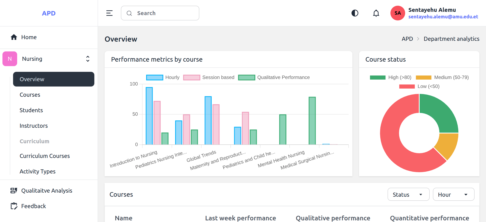

# WebAPD Instructor Guide

**WebAPD** empowers instructors to track performances of their courses, and analyze feedback from the department head. Follow these steps to get started:

1. **Set up your account** → [Account Setup Guide](setup-account)
2. **Log in** → [Login Instructions](login-instructions)

🔹 Need support?
Contact <wuletawwonte@gmail.com>.
