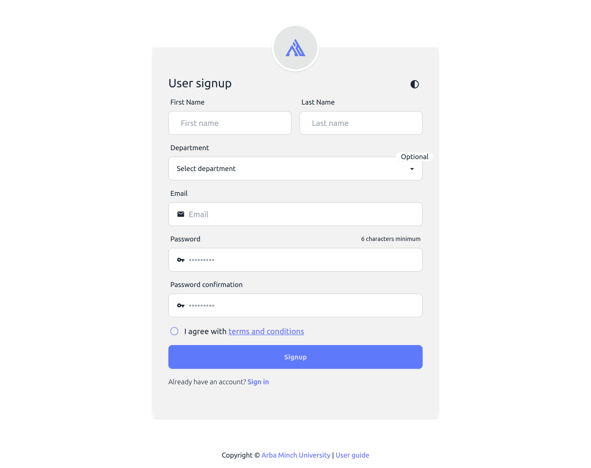

# Account Setup

## **Register as a Instructor**

### Prerequisites

- Active institutional email

### Steps

1. Visit WebAPD instructor Registration page: [https://amu.webapd.top/users/sign_up](https://amu.webapd.top/users/sign_up).
   
   _You can also open [https://amu.webapd.top](https://amu.webapd.top) and click on the `Sign up` link._
2. Fill in:

   - Department: Choose your department
   - Your Name: Please enter your name exactly as it appears on your staff ID.
   - Email: Please use your university-provided email; personal emails are also accepted.
   - Password: (8+ chars, include a number)
   - Terms and Conditions: Please read and accept

   _Ensure all details are correct before submitting._

3. Click the **Signup** button to complete your registration. You will be automatically logged into the system.
